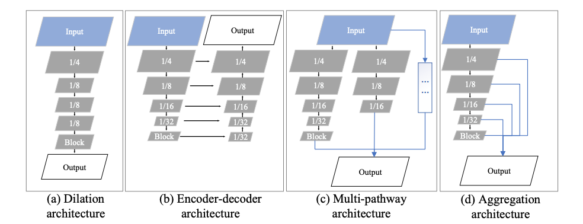
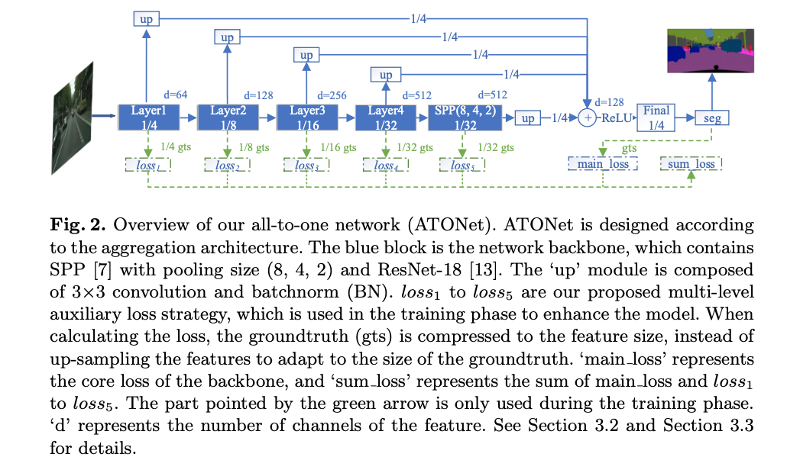
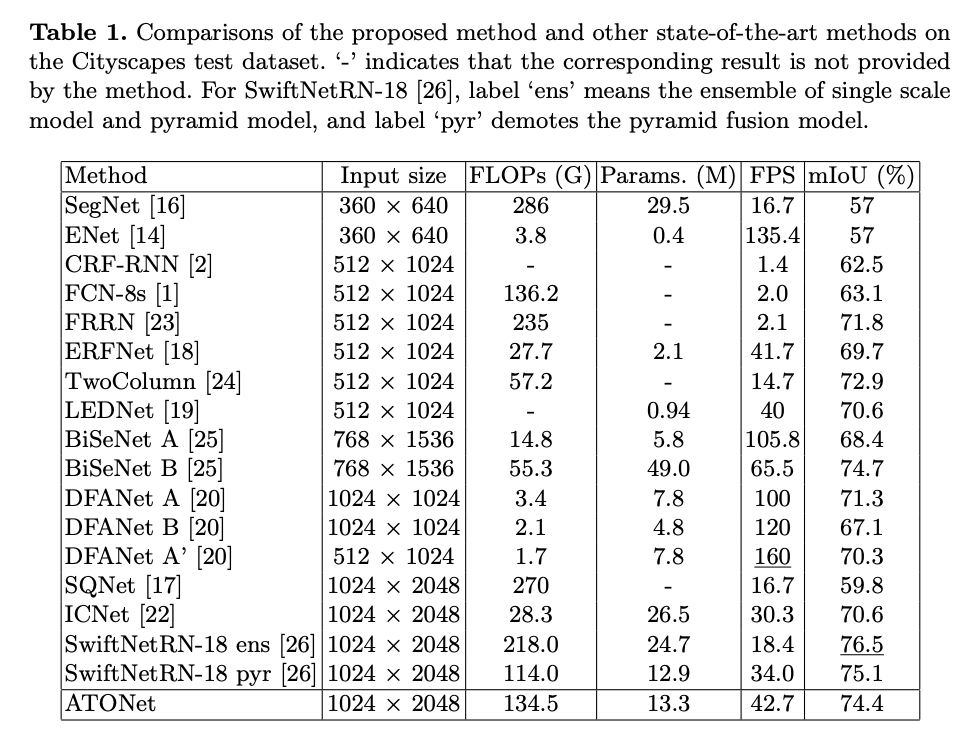
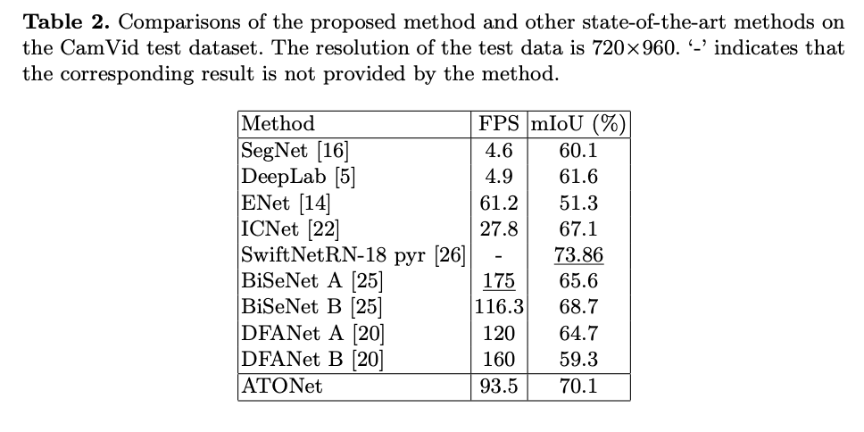
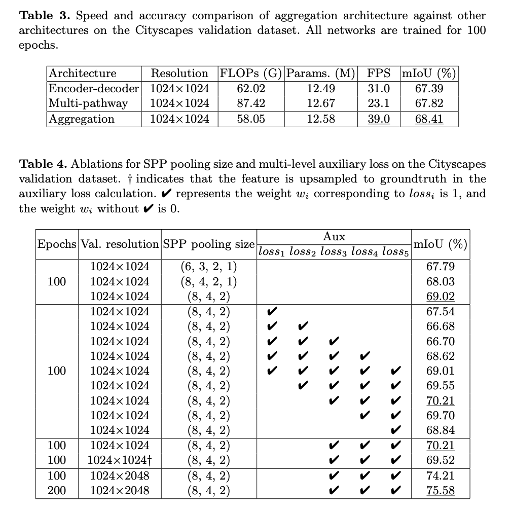

# Aggregation Architecture and All-to-One
Network for Real-time Semantic Segmentation
## Abstract:
Deep convolutional neural network has demonstrated its outstanding performance in the field of image semantic segmentation. However, the enormous computational complexity of existing high-precision
networks limits the application of the model in real-time segmentation
tasks. How to achieve a good trade-off between accuracy and speed
becomes a challenge. Existing solutions can be roughly divided into
three categories according to the network architecture: dilation, encoderdecoder, and multi-pathway, each of which has its advantages. In this
paper, we make the following contributions: (i) First, unlike the previous three architectures, we propose a new aggregation architecture as the
network backbone. (ii) Second, a multi-level auxiliary loss design model is
used for the training phase, which can improve the model segmentation
effect. (iii) According to this aggregation structure, an all-to-one network (ATONet) for real-time semantic segmentation is proposed, which
achieves a good trade-off between speed and accuracy by assembling the
features of all blocks. (iv) Finally, the proposed network achieves the
accuracy of 74.4% and 70.1% mIoU with the inference speed of 42.7 FPS
and 93.5 FPS on the urban street scenes test datasets Cityscapes and
CamVid, respectively.

## Network architecture

## Results

## Ablation

